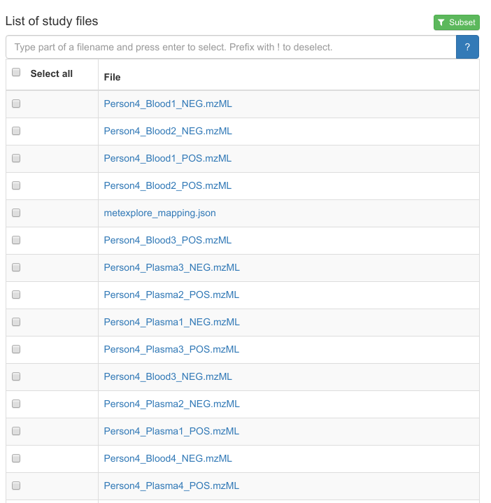

# Metabolomics

[prev](./identification.md) | [toc](./README.md) | [next](pathways.md)

<script>
  function toggleAnswer(id) {
  var answer = document.getElementById(id);
  if (answer.style.visibility === "hidden" ||
      answer.style.visibility === "none") {
    answer.style.visibility = "visible";
  } else {
    answer.style.visibility = "hidden";
  }
}
</script>


[MetaboLights](https://www.ebi.ac.uk/metabolights/) is a database
for metabolomics data hosted at the European Bioinformatics Institute.

ATP is a metabolite found in many biological processes. The compound
can be found in MetaboLights with the identifier
[MTBLC15422](https://www.ebi.ac.uk/metabolights/MTBLC15422). Under
the section `Biology` the studies are found, with identifiers starting
with the prefix `MTBLS`.

1. how many human studies found for ATP? <button onclick="toggleAnswer('q1')">Answer</button><span id="q1" style="visibility: hidden"> when you search via [https://www.ebi.ac.uk/metabolights/search](https://www.ebi.ac.uk/metabolights/search), at the time of writing, it lists 23 studies, with MTBLS87 being the oldest identifier.</span>
2. in how may other species has this metabolite be found? <button onclick="toggleAnswer('q2')">Answer</button><span id="q2" style="visibility: hidden"> The page lists more than ten other species.</span>

MetaboLights follows the [ISA framework](https://isa-tools.org/),
where ISA is short for Investigation, Study, and Assay. Following this standard, the information
about the study, investigations, and assays are stored in structured data (tabular files
in ISATab, and in a hierarchical model in ISAJSON). Additional file may be provided for
additional information. For example, MetaboLights uses files that start with the
prefix `m_` where information about the metabolites are collected.

The list of files may look like:



## Unexpected similarities

One of the studies where ATP was found is [MTBLS88](https://www.ebi.ac.uk/metabolights/MTBLS88).
This study compares human blood samples with
[Schizosaccharomyces](https://en.wikipedia.org/wiki/Schizosaccharomyces).

Download the `m_mtbls88_metabolite_profiling_mass_spectrometry_v2_maf.tsv` file from this study.
The first few lines look like:

```tsv
"database_identifier"	"chemical_formula"	"smiles"	"inchi"	"metabolite_identification"	"mass_to_charge"	"fragmentation"	"modifications"	"charge"	"retention_time"	"taxid"	"species"	"database"	"database_version"	"reliability"	"uri"	"search_engine"	"search_engine_score"	"smallmolecule_abundance_sub"	"smallmolecule_abundance_stdev_sub"	"smallmolecule_abundance_std_error_sub"	"Person4_Blood1_POS"	"Person4_Plasma1_POS"	"Person4_RBC1_POS"	"Person4_Blood2_POS"	"Person4_Plasma2_POS"	"Person4_RBC2_POS"	"Person4_Blood3_POS"	"Person4_Plasma3_POS"	"Person4_RBC3_POS"	"Person4_Blood4_POS"	"Person4_Plasma4_POS"	"Person4_RBC4_POS"
"CHEBI:16020"	"C11H15N5O4"	"CN1C=NC2=C(C1=N)N=CN2C3C(C(C(O3)CO)O)O"	"InChI=1S/C11H15N5O4/c1-15-3-14-10-6(9(15)12)13-4-16(10)11-8(19)7(18)5(2-17)20-11/h3-5,7-8,11-12,17-19H,2H2,1H3/t5-,7-,8-,11-/m1/s1"	"1-Methyl-adenosine"	"282.12"	""	"[M+H]+"	"positive"	"11.1"	"NCBITAXON:http://purl.obolibrary.org/obo/NCBITaxon_9606"	"Homo sapiens"	""	""	"5:very good reliability"	""	""	""	""	""	""	"6800000"	"5600000"	"6100000"	"6200000"	"4800000"	"6200000"	"6000000"	"4500000"	"6400000"	"6700000"	"5300000"	"7200000"
"CHEBI:19062"	"C11H15N5O5"	"CN1C(=O)C2=C(N=C1N)N(C=N2)C3C(C(C(O3)CO)O)O"	"InChI=1S/C11H15N5O5/c1-15-9(20)5-8(14-11(15)12)16(3-13-5)10-7(19)6(18)4(2-17)21-10/h3-4,6-7,10,17-19H,2H2,1H3,(H2,12,14)/t4-,6-,7-,10-/m1/s1"	"1-Methyl-guanosine"	"298.115"	""	"[M+H]+"	"positive"	"7.1"	"NCBITAXON:http://purl.obolibrary.org/obo/NCBITaxon_9606"	"Homo sapiens"	""	""	"5:very good reliability"	""	""	""	""	""	""	"190000"	"110000"	"140000"	"220000"	"160000"	"110000"	"210000"	"140000"	"130000"	"160000"	"110000"	"160000"
"CHEBI:84981"	"C6H9NO4-2"	"NC(CCCC([O-])=O)C([O-])=O"	"InChI=1S/C6H11NO4/c7-4(6(10)11)2-1-3-5(8)9/h4H,1-3,7H2,(H,8,9)(H,10,11)/p-2"	"2-Aminoadipate"	"162.076"	""	"[M+H]+"	"positive"	"12.2"	"NCBITAXON:http://purl.obolibrary.org/obo/NCBITaxon_9606"	"Homo sapiens"	""	""	"5:very good reliability"	""	""	""	""	""	""	"1400000"	"1400000"	"1400000"	"1400000"	"1400000"	"1200000"	"1400000"	"1300000"	"1100000"	"1500000"	"1500000"	"1500000"
"CHEBI:17836"	"C7H6NO2-"	"Nc1ccc(cc1)C([O-])=O"	"InChI=1S/C7H7NO2/c8-6-3-1-5(2-4-6)7(9)10/h1-4H,8H2,(H,9,10)/p-1"	"4-Aminobenzoate"	"138.055"	""	"[M+H]+"	"positive"	"7.2"	"NCBITAXON:http://purl.obolibrary.org/obo/NCBITaxon_9606"	"Homo sapiens"	""	""	"5:very good reliability"	""	""	""	""	""	""	"39000"	"39000"	"150000"	"24000"	"84000"	"150000"	"39000"	"76000"	"170000"	"74000"	"110000"	"240000"
```

Open this file in [RStudio Desktop](https://posit.co/download/rstudio-desktop/):


```R
mtbls88 = read.table(
  file = "m_mtbls88_metabolite_profiling_mass_spectrometry_v2_maf.tsv",
  header=TRUE
)
```

3. how many rows and columns has this file? <button onclick="toggleAnswer('q3')">Answer</button><span id="q3" style="visibility: hidden"> The file opens as a table with 78 data rows (and one header line) and 33 variables.</span>
4. why does the 49th data line list two ChEBI identifiers (for C₈H₁₅NO₃)? <button onclick="toggleAnswer('q4')">Answer</button><span id="q4" style="visibility: hidden"> Both metabolites have the same chemical formula, and the experimental data (probably) matches both structures.</span>

The metabolites can be sorted in the order the came of the chromatographic column. This information
is given in the `retention_time` column. We can sort the table with the following command:

```R
mtbls88[ order(mtbls88[,"retention_time"]), ]
```

5. what is the compound that came of the column first? <button onclick="toggleAnswer('q5')">Answer</button><span id="q5" style="visibility: hidden"> The metabolite with the lowest retention time. In fact, three metabolites are given for the shortest retention time of 3.8 (units?).</span>
6. what is the ChEBI identifier of this compound? <button onclick="toggleAnswer('q6')">Answer</button><span id="q6" style="visibility: hidden"> Well, since it was actually
three, we have three identifiers: CHEBI:27732, CHEBI:73054, and CHEBI:73061. You can get these easily with this R command: `mtbls88[order(mtbls88[,"retention_time"]),][1:3,"database_identifier"]`</span>

### Principal Component Analysis

Out discussed during the lecture, we do not need to know the metabolites to do a multivariate analysis
of the data. For example, the following R code can be used to run a principal component analysis (PCA):

```R
dataColumns = colnames(mtbls88)[22:33]
data = mtbls88[,dataColumns]
data.pca = prcomp(data, center = TRUE, scale. = TRUE)
biplot(data.pca, scale = 0, cex = .7)
```

7. which metabolite is the most descriptive for blood and RBC samples? <button onclick="toggleAnswer('q7')">Answer</button><span id="q7" style="visibility: hidden"> Metabolite 36, CHEBI:17858, which is gluthatione disulphide.</span>
8. what can you tell about the differences between blood, RBC, and plasma? <button onclick="toggleAnswer('q8')">Answer</button><span id="q8" style="visibility: hidden"> Plasma has quite different abundances of the metabolites: in the first two principal components, the abundances are almost orthogonal to that of blood, and RBC. (What does that say about the three sample types?)</span>

We can also transpose the matrix, and plot the different samples as points. That allows us to compare the various groups. There
are [better approaches](https://www.r-bloggers.com/computing-and-visualizing-pca-in-r/) but a quick go at this can be done with:

```R
data.pca2 = prcomp(t(data), center = TRUE, scale. = TRUE)
colors = c(
  "red",  # blood
  "blue", # plasma
  "green" # RBC
)
plot(data.pca2$x[,1:2], col=colors)
```

Does the separation of the sample types match your earlier observation?


---

[prev](./identification.md) | [toc](./README.md) | [next](pathways.md)

Copyright 2020-2025 (C) Egon Willighagen (Dept of Translational Genomics](https://www.maastrichtuniversity.nl/research/translational-genomics) - CC-BY Int. 4.0
