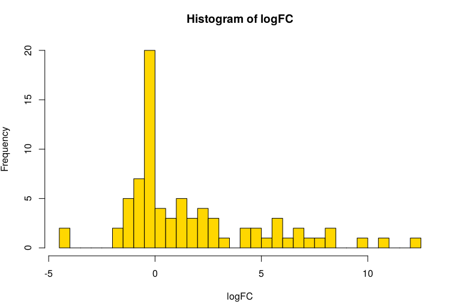
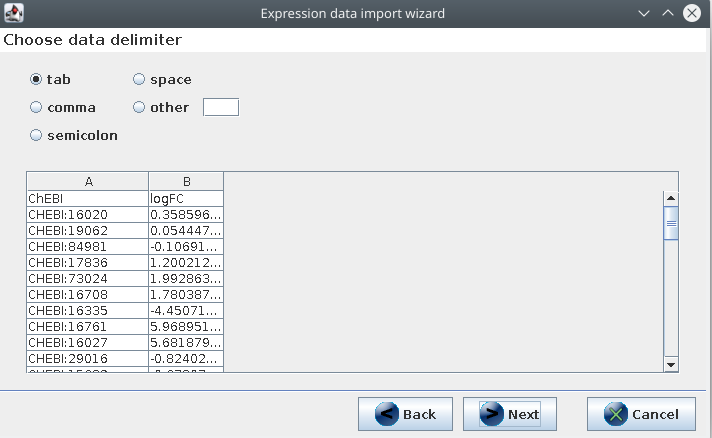
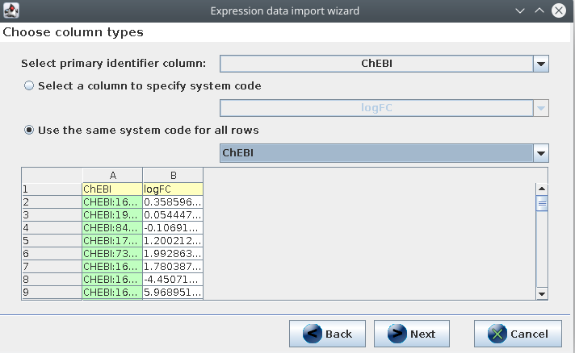
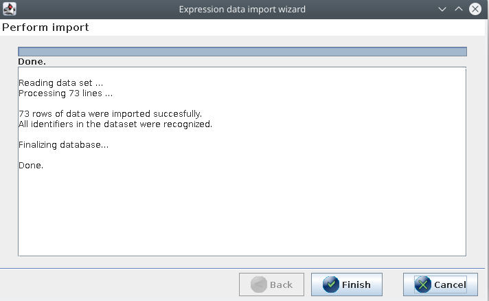
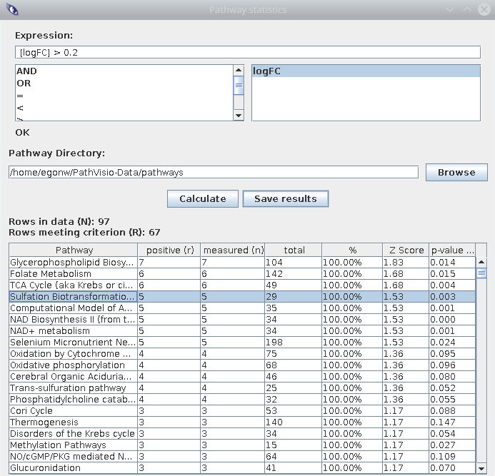
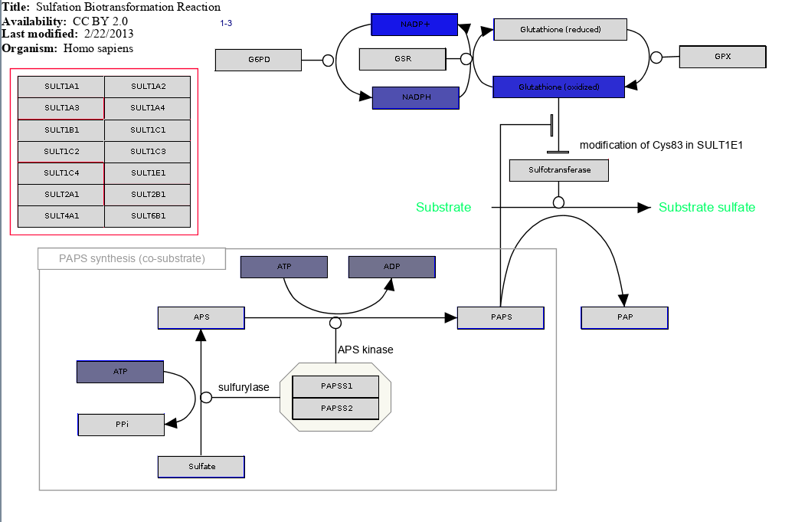
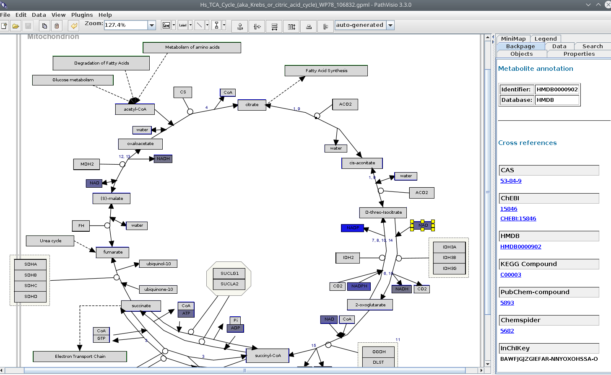

# Pathway Analysis

[prev](./omics.md) | [toc](./README.md)

Continuing from the data set we looked at in the [previous section](./omics.md), we first have
to define the two sitations we want to compare. Otherwise, we cannot saw which pathways
are changed when comparing the two situations. Let's compare the read bloos cell samples
with plasma:

```R
rbcColumns = c(
  "Person4_RBC1_POS", "Person4_RBC2_POS",
  "Person4_RBC3_POS", "Person4_RBC4_POS"
)
plasmaColumns = c(
  "Person4_Plasma1_POS", "Person4_Plasma2_POS",
  "Person4_Plasma3_POS", "Person4_Plasma4_POS"
)
```

Using these two groups, we can calculate log fold changes (logFC) with:

```R
logFC = log2(
  apply(mtbls88[,rbcColumns], 1, function(x) sum(x)) /
  apply(mtbls88[,plasmaColumns], 1, function(x) sum(x))
)
hist(logFC, breaks = 50, col="gold")
```

The `hist()` command shows a histogram of of the fold changes:



We are going to use this data in [PathVisio](https://pathvisio.github.io/) and need to export it
as a TSV file first. We create a new data matrix, and leave out a few rows:

```R
logFCdata = cbind(
    as.character(mtbls88[,"database_identifier"]),
    logFC
  )[-c(27,47,49,75,77),]
write.table(
  logFCdata, file = "logfc.tsv",
  sep = "\t",
  col.names = c("ChEBI", "logFC"),
  row.names = FALSE, quote = FALSE
)
```

## Loading the fold changes into PathVisio

Following the same approach for pathway analysis with other omics data, we can use this data
to find potentially interesting pathways. First, download the
[metabolite identifier database](https://bridgedb.github.io/data/gene_database/)
and open that in PathVisio with `Data`, `Select Metabolite Database`.

Then, import the `logfc.tsv` file you created in the previous step into PathVisio
with `Data`, `Import expression data`. The file is TAB separated:




The first `CHEBI` column has the identifiers, and they are all `ChEBI` identifiers:



If all went well with loading the metabolite identifier database and importing
the expression data, then all 73 data rows should be imported correctly and all identifiers
recognized:



## Finding pathways with PathVisio

The next step is to download the [human pathways](https://www.wikipathways.org/index.php/Download_Pathways)
and unzip the file locally. Maybe you have them still around from a previous practical. Then downloading
them again is not needed.

The pathway analysis goes in exactly the same way as for genes, except that we do not
have p-values. The analysis with `Data`, `Statistics...` has a simpler equation. The list of
metabolites is similar (or use the equation `[logFC] < -0.2 OR [logFC] > 0.2`):



Make sure to open the pathway to see what it looks like. For example, here is the
experimental data mapped onto [WP692](https://www.wikipathways.org/index.php/Pathway:WP692):



1. would you expect to see experimental data for reduced glutathion? <button onclick="toggleAnswer('q1')">Answer</button><span id="q1" style="visibility: hidden"> Maybe that could be expected. What are reasons why we do not have experimental data for it?</span>
2. if we look at the first few pathways, with the general patterns do we see? <button onclick="toggleAnswer('q2')">Answer</button><span id="q2" style="visibility: hidden"> Metabolites like ATP/ADP and NADP/NADPH show up in many pathways. What is the biological meaning of this?</span>


## General thoughts

3. are 73 metabolites enough to do pathway analysis? <button onclick="toggleAnswer('q3')">Answer</button><span id="q3" style="visibility: hidden"> One problem is that many pathways have only few metabolites measured. These pathways may, however, allow you to search in the original experimental data for unidentified metabolites.</span>

Open the TCA cycle pathway in PathVisio and click the `NAD` on the right side, and open the Backpage sidepanel in PathVisio, like this:



At the top we can see that the `NAD` node in the pathway is annotated with an HMDB identifier.
PathVisio used the BridgeDb metabolite identifier mapping database to recognize that the HMDB identifier in the pathway
and the ChEBI identifier for the experimental data actually are about the same metabolite. Then:

4. thinking about the previous sections of this practical and the lecture, what other things could we do to improve this analysis? <button onclick="toggleAnswer('q4')">Answer</button><span id="q4" style="visibility: hidden"> The current analysis.</span>


---

[prev](./omics.md) | [toc](./README.md)

Copyright 2020 (C) Egon Willighagen - CC-BY Int. 4.0
